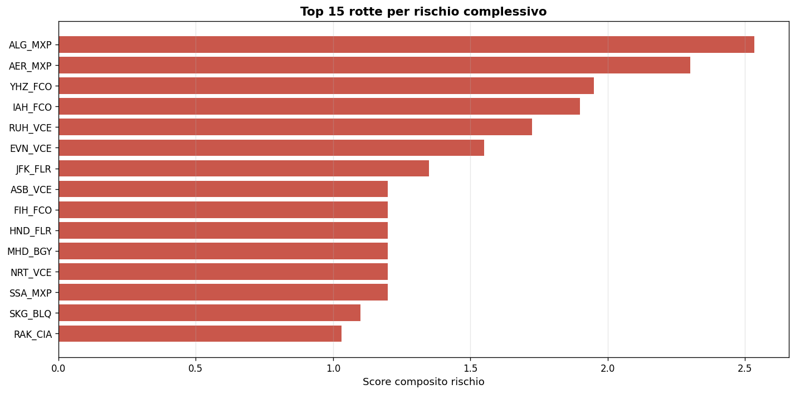
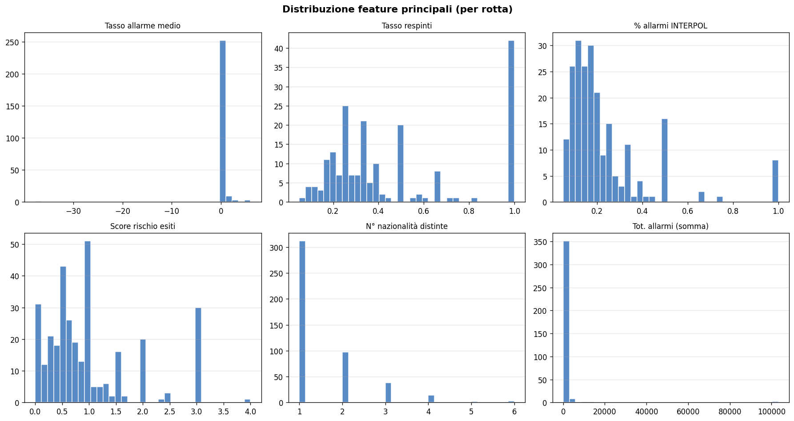
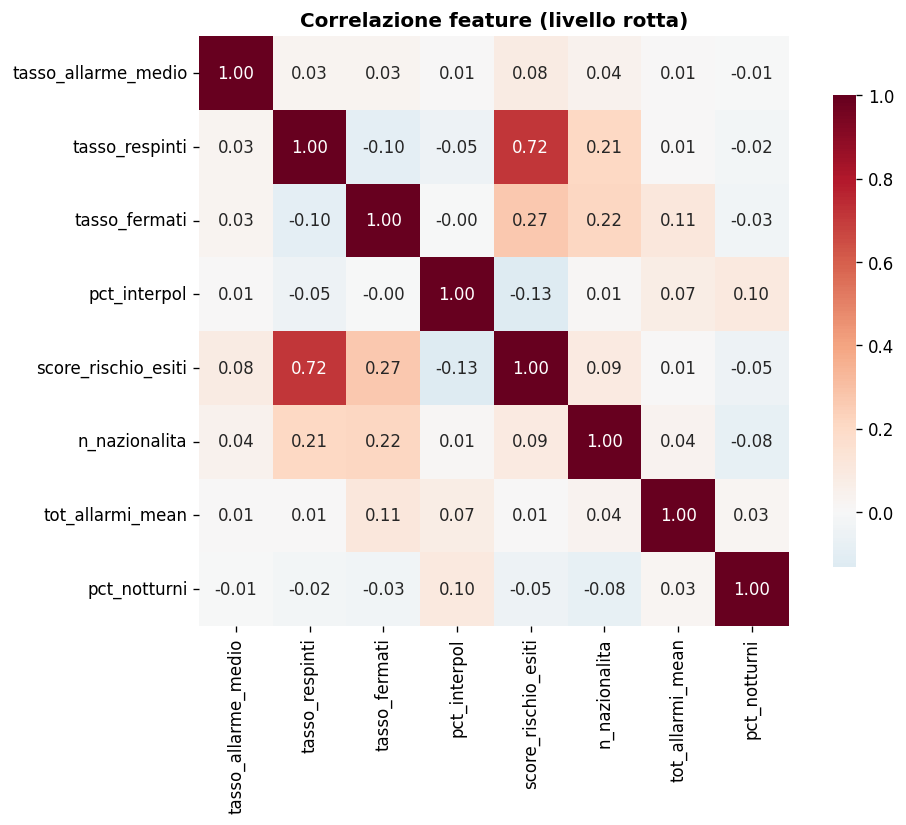

# Airport Risk Intelligence
**Reply × LUISS 2026 — Project 2**

---

## Who we are and what this is

We're a team of students competing in the **Reply × LUISS 2026** challenge. For Project 2 we were asked to build an anomaly-detection system on real airport security data and then argue which architectural approach works best.

Rather than just picking one approach and running with it, we decided to **build the same system twice** — once as a classical sequential pipeline (notebooks + Python scripts) and once as a **LangGraph multi-agent system** — so we could compare them properly. Same data, same features, same detection logic, two completely different architectures.

The question we're trying to answer: *when does adding agent orchestration actually buy you something over a well-written classical pipeline?*

---

## The problem

Border control at Italian airports generates a lot of data: every passenger transit, every security alert, every document check. Most of this data sits unused until something goes wrong.

Our system looks at **routes** — pairs of `departure_airport → arrival_airport` (e.g. `CAI-FCO`, Cairo to Rome Fiumicino) — and asks: *is this route behaving anomalously compared to all the others?*

Concretely, we're looking for routes with unusual combinations of:
- High alarm rates (Interpol, SDI, NSIS)
- High investigation and rejection rates
- Low closure rates (alarms that don't get resolved)
- Unusual traveller profiles

We have ~567 unique routes and ~13 months of data. The output is a risk label per route: **ALTA** (top 3%), **MEDIA** (top 10%), **NORMALE**, plus a final business-rule classification CRITICO / ALTO / MEDIO / BASSO.

---

## Our reasoning

### Why a classical pipeline first

We started classically because it forced us to understand the data properly. Six notebooks, step by step: EDA, feature engineering, baseline construction, anomaly detection, post-processing, evaluation. By the end we had 54 features per route, a hybrid Tukey IQR + 2.5σ z-score baseline (more interpretable when explaining flags one feature at a time), and a 4-model weighted ensemble — IsolationForest, LOF, Z-score composite, and an Autoencoder.

The classical pipeline works well: reproducible, easy to audit, fast to iterate on. Its main limitation is rigidity — if you want to re-run on a different time window, or filter to a specific country, you re-run the whole thing.

### Why we then built a multi-agent version

The multi-agent version (LangGraph) replicates the **exact same detection logic** but as a graph of five specialised agents. The interesting part isn't the detection — it's what you gain architecturally:

- **Dynamic perimeter filtering**: pass `{anno, paese, aeroporto, zona}` at runtime and only the relevant data flows through the graph
- **LLM explanations**: a `ReportAgent` uses Claude to generate plain-English narratives for each anomalous route, citing the specific z-score drivers and the business rules that fired
- **Modularity**: each agent fails, retries, or is swapped independently — you don't re-run the whole thing if one stage changes
- **Deterministic when needed**: `run_report=False` skips the LLM and produces the same numerical output as the classical pipeline in ~1.3 s

The trade-off is complexity: a classical pipeline is easier to debug; a multi-agent system is more flexible and operationally richer.

The five agents:

| # | Agent | Responsibility |
|---|-------|---------------|
| 1 | `DataAgent` | Loads `ALLARMI` + `TIPOLOGIA_VIAGGIATORE`, applies the user-defined perimeter |
| 2 | `FeatureAgent` | Aggregates 54 numerical features per route via `FeatureBuilder` (shared with the classical pipeline) |
| 3 | `BaselineAgent` | Robust MAD z-scores per BASELINE_FEATURE → composite `baseline_score` |
| 4 | `OutlierAgent` | 4-model weighted ensemble (real `sklearn` IF + LOF + Z + Autoencoder) → `ensemble_score` and `risk_label` (ALTA/MEDIA/NORMALE) |
| 5 | `RiskProfilingAgent` | Five business rules → `confidence` (60% ML + 40% rules) → `final_risk` (CRITICO/ALTO/MEDIO/BASSO) |
| (opt) | `ReportAgent` | LLM narrative for each ALTA/MEDIA route, citing top z-score drivers and risk drivers |

### What we found

After running both pipelines on the same 567 routes:

| Metric | Value |
|--------|-------|
| Same `anomaly_label` (ALTA/MEDIA/NORMALE) | **97.2 %** (551/567) |
| Distribution (ALTA / MEDIA / NORMALE) | **17 / 40 / 510** in BOTH pipelines |
| `ensemble_score` Pearson r | **0.9847** |
| `ensemble_score` Spearman ρ | **0.9864** |
| Per-model agreement: IsolationForest | **r = 1.0000** |
| Per-model agreement: LOF | **r = 1.0000** |
| Per-model agreement: Autoencoder | **r = 0.9663** (stochastic training) |
| Top-10 most-anomalous routes overlap | **9 / 10** |
| Top-50 most-anomalous routes overlap | **44 / 50** |

So the architectures converge on the same answer — the multi-agent version just gets there in a way that's operationally more useful (filtering, explanations, modular failure handling).

The notebook `notebooks/07_comparison_classical_vs_multiagent.ipynb` contains the full quantitative comparison, including confusion matrix, score correlation, rank-delta distribution, and final recommendation.

---

## Results







---

## Project structure

```
classical-vs-multiagent/
│
├── README.md
├── requirements.txt
├── .env.example                        # ANTHROPIC_API_KEY template
│
├── images/                             # Charts and visualisations
│   ├── top_routes_risk.png
│   ├── feature_distributions.png
│   └── feature_correlation.png
│
├── data/
│   ├── raw/                            # Source CSVs (gitignored — confidential)
│   │   ├── ALLARMI.csv
│   │   └── TIPOLOGIA_VIAGGIATORE.csv
│   └── processed/                      # Pipeline outputs (gitignored)
│
├── classical_pipeline/                 # ── Pipeline 1 ──────────────────────
│   ├── main.py                         # End-to-end orchestrator (single script)
│   └── notebooks/
│       ├── 01_EDA.ipynb
│       ├── 02_feature_engineering.ipynb
│       ├── 03_baseline_construction.ipynb
│       ├── 04_anomaly_detection.ipynb
│       ├── 05_post_processing.ipynb
│       └── 06_evaluation.ipynb
│
├── multiagent_pipeline/                # ── Pipeline 2 (LangGraph) ──────────
│   ├── main.py                         # Graph orchestrator
│   ├── state.py                        # Shared AgentState schema
│   ├── config.py                       # API key + model config
│   ├── agents/
│   │   ├── data_agent.py               # Loads + filters raw CSVs
│   │   ├── feature_agent.py            # Builds 54 features per route
│   │   ├── baseline_agent.py           # Robust MAD z-scores
│   │   ├── outlier_agent.py            # 4-model weighted ensemble
│   │   ├── risk_profiling_agent.py     # 5 business rules + final_risk
│   │   └── report_agent.py             # LLM narrative explanations
│   ├── src/
│   │   └── features.py                 # FeatureBuilder (shared with classical)
│   ├── tools/
│   │   └── data_tools.py               # Perimeter filtering helpers
│   └── tests/
│       └── e2e_validation.py           # 5-perimeter regression suite
│
├── shared/
│   └── preprocessing.py                # Data cleaning used by both pipelines
│
├── streamlit_app/                      # ── Dashboard ────────────────────────
│   ├── app.py                          # Streamlit application (6 tabs)
│   └── agent_graph.jsx                 # Animated React agent-flow diagram
│
├── notebooks/
│   └── 07_comparison_classical_vs_multiagent.ipynb   # The head-to-head
│
└── docs/
    └── Reply_projects.pdf              # Original brief from Reply
```

---

## How to run it

### Setup

```bash
git clone https://github.com/DanieleGiovanardi2408/classical-vs-multiagent.git
cd classical-vs-multiagent
python -m venv venv && source venv/bin/activate
pip install -r requirements.txt
```

Add the raw data files:
```
data/raw/ALLARMI.csv
data/raw/TIPOLOGIA_VIAGGIATORE.csv
```

### Classical pipeline

Run everything end-to-end:
```bash
PYTHONPATH=. python classical_pipeline/main.py --skip-eval     # ~3 s
PYTHONPATH=. python classical_pipeline/main.py                 # ~30 s incl. evaluation step
```

Or open the notebooks in order for the step-by-step walkthrough:
```bash
jupyter lab classical_pipeline/notebooks/
```

### Multi-agent pipeline

```python
from multiagent_pipeline.main import run_pipeline

# Without LLM (no API key needed)
state, summary = run_pipeline({"anno": 2024}, run_report=False, save_outputs=True)
# -> state["df_risk"]:  567 routes × 92 columns (incl. final_risk + risk_drivers)
# -> state["risk_meta"]["n_critico"], ["n_alto"], ["n_medio"], ["n_basso"]

# With LLM explanations (needs ANTHROPIC_API_KEY in .env)
state, summary = run_pipeline(
    {"anno": 2024},
    run_report=True,
    use_llm=True,
    save_outputs=True,
)
print(state["report"]["summary"])
```

### Comparison notebook

After running both pipelines:
```bash
PYTHONPATH=. jupyter lab notebooks/07_comparison_classical_vs_multiagent.ipynb
```

### Validation suite

5-perimeter regression test (no LLM, ~3 s):
```bash
PYTHONPATH=. python multiagent_pipeline/tests/e2e_validation.py
# -> data/processed/multiagent_validation_report.json
```

### Dashboard (the nicest way to see everything)

```bash
streamlit run streamlit_app/app.py
```

Opens at `http://localhost:8501`. From here you can:
- Run the multi-agent pipeline with any filter combination
- See the agent graph animate as each of the 5 stages completes
- Explore the route map — click any route to see its risk details and the LLM explanation
- Compare classical vs multi-agent scores side by side

### LLM report (optional)

The `ReportAgent` calls Claude to generate plain-English explanations for each anomalous route. To enable it:

```bash
cp .env.example .env
# Add your key: ANTHROPIC_API_KEY=sk-ant-...
```

Then check **Enable LLM Report** in the dashboard sidebar before running. Without a key, use **Dry run** mode which runs the full pipeline but skips the API calls.

---

## Design choices we want to flag explicitly

- **Different baseline methods on purpose.** Classical uses hybrid Tukey IQR + 2.5σ z-score (per-feature flags, more interpretable when justifying a single anomalous feature); multi-agent uses robust MAD z-scores (single composite score, more robust to outliers, easier to explain to an LLM as a "deviation in σ"). Both methods are deliberately idiomatic for their architecture; the comparative analysis (notebook 07) shows the final outputs converge regardless.
- **Autoencoder as 4th ensemble model.** The Reply spec lists `IsolationForest`, `LOF`, or `Z-score`. We added an MLPRegressor autoencoder (weight 0.20) because (a) it captures non-linear feature combinations the other three miss, and (b) it gracefully degrades — auto-excluded with weight redistribution when fewer than 30 normal samples are available, so small perimeters still work.
- **Same business rules in both pipelines.** The classical `step_post_processing` and the multi-agent `RiskProfilingAgent` share five identical rules with identical thresholds (high INTERPOL %, high rejection rate, low closure on volume, multi-source alarms, high average alarm rate). The `br_score` Pearson correlation between the two pipelines is exactly **1.000** — by construction.

---

## Tech stack

- **Data & ML**: pandas, numpy, scipy, scikit-learn
- **Agent orchestration**: LangGraph, LangChain
- **LLM**: Anthropic Claude (`claude-sonnet-4-5`)
- **Dashboard**: Streamlit, Plotly, Altair
- **Agent visualisation**: React 18 + Babel (embedded in Streamlit)
- **Explainability**: SHAP (surrogate GradientBoosting in the classical evaluation step)

---

*Reply × LUISS 2026*
