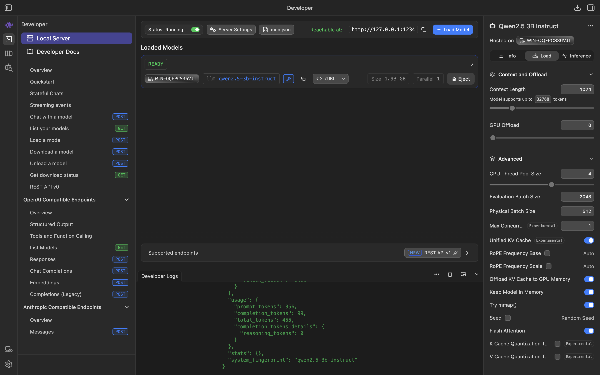

# Airport Risk Intelligence

**Reply × LUISS 2026, Project 2 (Classical vs Multi-Agent)**
Team: Daniele Giovanardi · Filippo Nannucci · Edoardo Riva

---

## Table of contents

1. [Executive summary](#1-executive-summary)
2. [Project context](#2-project-context)
3. [Dataset](#3-dataset)
4. [Methodology](#4-methodology)
5. [Multi-agent architecture](#5-multi-agent-architecture)
6. [Results](#6-results)
7. [Design rationale](#7-design-rationale)
8. [Repository structure](#8-repository-structure)
9. [How to reproduce](#9-how-to-reproduce)
10. [Reproducibility note on figures and tables](#10-reproducibility-note-on-figures-and-tables)

---

## 1. Executive summary

The Reply brief asks whether a multi-agent orchestration on LangGraph adds enough operational value to justify its complexity, compared to a classical sequential anomaly-detection pipeline. We implement the same detection logic twice, once as a sequential script and once as a five-agent LangGraph DAG, and compare them on a 567-route Italian border-control dataset.

The main numbers, all reproduced by `notebooks/08_report_assets.ipynb` from the processed CSVs:

| Metric | Value |
|---|---|
| Routes analysed | 567 |
| Anomaly-label distribution (both pipelines) | **17 HIGH / 40 MEDIUM / 510 NORMAL** |
| Final-risk distribution (both pipelines) | **9 CRITICAL / 29 HIGH / 19 MEDIUM / 510 LOW** |
| Per-route label agreement (`anomaly_label`) | **100.00 %** (567 / 567) |
| Per-route label agreement (`final_risk`)    | **100.00 %** (567 / 567) |
| Pearson r on the final scalar score | **≈ 1.0** (float rounding only, see §6.4) |
| Spearman ρ on the final scalar score | **≈ 1.0** |
| Business-rule hits (all 5 rules) | **Identical, delta = 0** (r = 1.000 by construction) |
| Top-50 anomalous routes overlap | **50 / 50** |
| Top-10 anomalous routes overlap | **10 / 10** |
| Ensemble weight choice | **Data-driven** (ablation + 4-simplex grid search, Section 4.4.1) |
| Threshold-sensitivity max swing on CRITICAL + HIGH (±10 %) | **2.6 %** (1 route) |

The two architectures produce identical anomaly and final-risk labels on all 567 routes. Both pipelines apply the same `anno = 2024` perimeter and aggregate the identical record set, so all four detectors and the blended score are identical up to CSV float rounding (Pearson r ≈ 1.0). That rounding is far too small to move any label or reorder the top routes. What the multi-agent design adds over the sequential script is operational rather than statistical: an LLM-narrated explanation per HIGH/MEDIUM route, dynamic perimeter filtering at runtime, per-agent failure isolation, and a bounded feedback cycle when the verifier disagrees with the first pass. The classical script does not provide these properties without significant refactoring.

The 100 % label agreement is a property of the code, not a coincidence. The Autoencoder, historically the only stochastic component of the ensemble, is now deterministic: both pipelines train it through the shared `shared/autoencoder.py` module (details in §4.4). With that source of run-to-run noise removed and the business rules applying the same thresholds on both sides, the two pipelines produce identical labels.

---

## 2. Project context

### 2.1 The brief

Reply assigned an automated **dataset-validation use case** as the framing for Project 2 of the *Machine Learning* LUISS course. The scenario is a digital platform of the Italian Ministry of Economy and Finance (MEF) that ingests heterogeneous datasets from third-party authorities and validates them automatically. The deliverable asks for an anomaly-detection system that could be plugged into such a platform, accepting heterogeneous tabular records, producing a route-level risk classification and a human-readable explanation per HIGH/MEDIUM route, and surfacing the results to an analyst.

The dataset Reply provided is **not** the platform's own data: it is a sample of border-control passenger transits at Italian airports, used as an example of the kind of heterogeneous third-party dataset such a platform would receive. The 567 origin/destination route pairs are the unit of analysis a customs officer would work with operationally.

### 2.2 What we built

Two implementations of the same detection logic, sharing the same preprocessing module, the same `FeatureBuilder` (54 numerical features per route), the same MAD-based baseline, the same four-model ensemble, the same five business rules and the same ensemble weights:

1. **Classical pipeline.** Seven sequential steps: EDA, preprocessing, feature engineering, baseline, ensemble, post-processing, evaluation. Inlined in `main.ipynb` so a reviewer can read it top-to-bottom without leaving the notebook. A standalone `classical_pipeline/main.py` orchestrator is also available for batch runs.
2. **Multi-agent pipeline.** A LangGraph DAG with five specialised agents (`DataAgent`, `BaselineAgent`, `OutlierAgent`, `RiskProfilingAgent`, `ReportAgent`) plus a `SupervisorAgent` verifier wired into the graph as a conditional branch with a bounded feedback cycle. Lives in `multiagent_pipeline/` and is imported by Sections 8 to 12 of `main.ipynb`.

### 2.3 Alignment guarantee

Both pipelines apply the same five business rules with the same thresholds, and the labels they produce share the same English vocabulary: `HIGH / MEDIUM / NORMAL` at the ensemble layer, `CRITICAL / HIGH / MEDIUM / LOW` after the rules. The earlier Italian/English label drift between the two implementations has been removed. The BR hit counts now coincide on every route (zero delta on all five rules), and after the AE alignment described in §4.4 the disagreement on `anomaly_label` is zero.

---

## 3. Dataset

### 3.1 Raw layer

Reply provides two CSV files at the bottom of `data/raw/` (NDA-protected, **not** redistributed in this repository):

| File | Granularity | Rows | Key columns |
|---|---|---|---|
| `ALLARMI.csv` | one row per alarm (Interpol, SDI, NSIS) generated by a border control | 5 080 | route, year-month, motive, outcome (`chiuso` / `respinto` / `fermato` / `segnalato`) |
| `TIPOLOGIA_VIAGGIATORE.csv` | one row per traveller-profile transit on a route-month | 5 095 | nationality, route, year-month, total entered, alarmed, investigated |

### 3.2 Temporal coverage

The raw data covers two full months, January and February 2024, plus a 4-record tail dated 31 December 2023. The analysis perimeter is the 2024 year (`anno = 2024`), applied to both pipelines, so they aggregate the identical record set and the December tail is excluded. Either way the panel is far too short for STL-style decomposition, which needs at least 12 observations per series, so we fall back on cross-sectional robust statistics.

### 3.3 Geographic coverage

Routes terminate or originate at Italian airports (FCO, MXP, LIN, BLQ, NAP, and others). Departure countries are dominated by neighbouring and high-traffic destinations; the full ranking by passenger volume is in `images/tables/top_countries_by_volume.csv`.

### 3.4 Unit of analysis

After cleaning and aggregating monthly, the unit of analysis is a **route**, that is an `airport_departure -> airport_arrival` pair (e.g. `CMN-FCO` for Casablanca to Rome Fiumicino). The cleaned panel contains **567 unique routes**, each described by **54 numerical columns**: the 53 input features documented in `data/processed/feature_cols.json`, plus the derived composite `score_composito` (used as the surrogate target in §6.8). The thirteen features used as inputs to the baseline are reported in §4.3 below.

---

## 4. Methodology

The methodology splits naturally into six layers, identical on both pipelines and implemented through the same shared modules.

### 4.1 Preprocessing

`shared/preprocessing.py` performs cleaning and merging in one pass:

* **Date parsing.** `DATA_PARTENZA` is parsed by a routine that maps Italian month names (`GEN`…`DIC`) to English, tries seven explicit formats and falls back to a `dayfirst` parse; values that still fail to parse become `NaT`.
* **Country-code normalisation.** ISO-2 codes are mapped to ISO-3 via an embedded lookup table; departure-country labels are stripped of stray casing and whitespace.
* **Gender normalisation.** The raw `GENERE` field carries inconsistent encodings (`M`, `m`, `M.`, `Maschio`); recognised values collapse to `M` / `F`, while ambiguous codes (e.g. `1` / `2`) are set to `NaN` rather than guessed.
* **Sparse-column drop.** Columns with more than 50 % nulls (`NULL_DROP_THRESHOLD = 0.50`) are dropped before the route-level merge.
* **Route-and-date merge.** Traveller records are aggregated by `(AREOPORTO_ARRIVO, AREOPORTO_PARTENZA, departure date)` and left-joined onto the alarm records on those three keys, keeping every alarm row. The result, `dataset_merged.csv`, is at the alarm grain (one row per alarm record, about 5,080 rows), not yet route-level; the aggregation to the 567 routes happens in feature engineering (§4.2).

### 4.2 Feature engineering

`multiagent_pipeline/src/features.py` builds **54 numerical features per route**. The route set comes from an outer join on `ROTTA` of the alarm aggregator (368 routes) and the traveller aggregator (467 routes), so their union is **567 routes** (268 present in both, 100 alarm-only, 199 traveller-only). The features fall into four families:

| Family | Examples | Purpose |
|---|---|---|
| Volume | `tot_allarmi_sum`, `tot_allarmi_log`, `tot_entrati`, `tot_investigati` | Magnitude of the operational signal |
| Composition | `pct_interpol`, `pct_sdi`, `pct_nsis` | Which intelligence database the alarms come from |
| Rates | `tasso_chiusura`, `tasso_respinti`, `tasso_fermati`, `tasso_allarme_medio` | Outcome-side density |
| Stability | `false_positive_rate`, `alarm_per_invest` | Quality of the investigation pipeline |

### 4.3 Robust baseline

`BaselineAgent` (and the equivalent classical step) turns each of 13 input features into a per-route deviation score and averages them. Per feature it uses a robust z-score built on the median and the **Median Absolute Deviation (MAD)**:

```
mad = median(|x - median(x)|)
z   = (x - median(x)) / (1.4826 * mad)     if mad > 0
z   = (x - median(x)) / std(x)             if mad == 0 but std > 0   (sparse-feature fallback)
z   = 0                                     if the column is constant
```

The factor **1.4826** (= 1 / 0.6745) rescales the MAD so it estimates the standard deviation sigma under a normal model: for a normal distribution MAD is about 0.6745 * sigma, so multiplying by 1.4826 brings the MAD-based z onto the same scale as an ordinary z-score.

A feature's MAD is exactly 0 whenever at least half of its routes carry the same value (a property of the median). On this dataset that holds for **12 of the 13** features, which are sparse (most routes sit at the same baseline value, usually 0), so the std fallback applies to them; the MAD is non-zero only for `tot_allarmi_log`, the single dense volume feature. The fallback still flags routes whose value sits far above the bulk, which is what the baseline needs, and using MAD where it is defined and std otherwise avoids an extra configuration knob.

The 13 baseline features are:

`tot_allarmi_log`, `pct_interpol`, `pct_sdi`, `pct_nsis`, `tasso_chiusura`, `tasso_rilevanza`, `tasso_allarme_medio`, `tasso_inv_medio`, `score_rischio_esiti`, `tasso_respinti`, `tasso_fermati`, `false_positive_rate`, `alarm_per_invest`.

The composite `baseline_score` is the mean of the absolute z-scores across these 13 features. It enters the ensemble as the Z-score component (§4.4).

### 4.4 Ensemble anomaly detection

`OutlierAgent` (and the equivalent classical step) trains four independent detectors on the 13-feature matrix, normalises each output to [0, 1], and blends them into a single `ensemble_score`. The four weights below are **data-driven**: they were chosen from the ablation study (§4.4.1), which assigns each detector an explicit role, and validated against a grid search over the 4-simplex; they supersede the original literature defaults (0.35 / 0.30 / 0.15 / 0.20).

| Detector | Weight | Hyper-parameters | Implementation |
|---|---|---|---|
| Isolation Forest | **0.40** | `contamination = 0.10`, `n_estimators = 200`, `random_state = 42` | `sklearn.ensemble.IsolationForest` |
| Local Outlier Factor | **0.15** | `n_neighbors = 20`, `contamination = 0.10` | `sklearn.neighbors.LocalOutlierFactor` |
| Z-score (MAD) | **0.30** | consumes `baseline_score` directly | shared module |
| Autoencoder (MLP) | **0.15** | architecture `13 → 8 → 4 → 8 → 13`, trained on the 510 normal routes via semi-supervision; deterministic single-module implementation (`shared/autoencoder.py`), `early_stopping = False`, sort by route id, no per-run variability | `sklearn.neural_network.MLPRegressor` |

The ensemble degrades gracefully: with fewer than 30 normal routes available, the Autoencoder is excluded from the blend and its 0.15 weight is redistributed proportionally over IsolationForest, LOF and the Z-score.

#### 4.4.1 Data-driven weight choice: ablation and grid search

We validate the choice of weights with two complementary analyses, both implemented in `multiagent_pipeline/src/` and re-runnable from `notebooks/08_report_assets.ipynb`.

**Ablation study** (`ensemble_ablation.py`). We drop one detector at a time, renormalise the remaining weights to sum to one, and compare the resulting top-17 HIGH set against the full ensemble. Results on the 567-route population:

| Subset | Top-17 overlap vs full | Business-rule rank correlation |
|---|---|---|
| IF only         | 0.765 | 0.580 |
| LOF only        | 0.000 | 0.200 |
| Z only          | 0.471 | 0.587 |
| AE only         | 0.471 | 0.356 |
| IF + LOF + Z    | 0.824 | 0.577 |
| IF + LOF + AE   | 0.824 | 0.513 |
| IF + Z + AE     | **1.000** | **0.558** |
| LOF + Z + AE    | 0.706 | 0.494 |
| IF + LOF + Z + AE (full) | 1.000 | 0.549 |

Two observations from the table. First, **dropping LOF leaves the top-17 unchanged** and slightly improves the rank correlation with `br_score` (0.558 vs 0.549 for the full ensemble): LOF contributes mostly redundancy with the IF density signal, which is the empirical justification for cutting its weight from 0.30 to 0.15. Second, **dropping AE pushes the top-17 overlap down to 0.824** (three routes leave the HIGH set) while the BR rank correlation does not fall (0.577, versus 0.549 for the full ensemble): the rule-aligned detectors carry that signal. The AE's contribution is therefore to the ML side of the verdict — which routes are anomalous — not to rule alignment. It captures non-linear feature combinations the other three detectors miss, so it stays in the blend at a reduced weight.


*Figure 1. Ablation result. Blue bars show top-17 overlap with the full ensemble; orange bars show the Spearman correlation between the ensemble score and the business-rule score.*

**Grid search** (`ensemble_grid_search.py`). We enumerate the 4-simplex of weight vectors at step 0.05 (all four weights strictly positive, summing to one, around 969 vectors) and score every vector by

```
objective = 0.5 · bootstrap_stability(top-17, 80% subsample, 200 resamples) + 0.5 · ((BR_rank_corr + 1) / 2)
```

The objective rewards weight vectors whose top-17 HIGH set survives bootstrap resampling and whose ensemble score rank-correlates with the business-rule score. The two halves act as a sanity check on each other: stability alone would favour degenerate weightings, rule correlation alone would mirror the rules at the expense of the ML signal.

We read the grid as a **robustness check, not an optimiser that crowns a winner**: in an unsupervised setting there is no ground truth to declare one weight vector uniquely correct. Two facts make this concrete. First, the objective surface is a flat plateau — across all 969 vectors it spans only 0.739–0.804 (median 0.776). Second, the `stability` half is almost constant over the whole simplex (0.776–0.824), so the only real gradient is the BR-correlation half, which is partly circular (the Z detector shares its 13 features with the business rules, see the caveat). The unconstrained argmax reflects this: it lands on a near-degenerate vector (here IF 0.60 / Z 0.20 / AE 0.05) and *moves across the simplex when the bootstrap is reseeded*, so it is not a stable target.

| Weight vector | IF | LOF | Z | AE | Stability | BR rank corr | Objective | Rank |
|---|---|---|---|---|---|---|---|---|
| Initial literature defaults | 0.35 | 0.30 | 0.15 | 0.20 | 0.797 | 0.491 | 0.771 | 610 / 969 |
| **Production (ablation-chosen)** | **0.40** | **0.15** | **0.30** | **0.15** | **0.808** | **0.549** | **0.791** | **73 / 969** |
| Plateau, all 969 vectors | — | — | — | — | 0.776–0.824 | — | 0.739–0.804 | — |

The grid still confirms the ablation. Moving from the naive literature defaults to the production weights — cut LOF (−0.15, the redundant detector), raise Z (+0.15, the most rule-aligned detector) — lifts the BR rank correlation from 0.491 to 0.549 and the objective from 0.771 to 0.791, pushing the weights from the bottom third of the simplex (rank 610) into the **top ~8 % (rank 73), 1.6 % below the global maximum**. We deliberately stop there rather than chase the argmax: on a plateau whose only gradient is a partly-circular term, optimising harder would just mirror the rules. In any case the choice barely matters operationally: the production weights and the unconstrained argmax agree on **16 of the 17 HIGH routes**, and even the naive literature defaults agree on 15 of 17. IF stays the heaviest weight, LOF is halved for the redundancy reason above, Z is doubled because it has the highest individual BR rank correlation, and AE is trimmed but retained for non-linear coverage.


*Figure 2. Marginal heatmap of the grid-search objective over (w_IF, w_Z), max over w_LOF and w_AE. The surface is a flat plateau (objective 0.74–0.80 across all 969 vectors). The star marks the production weights (ablation-chosen); the cross marks the unconstrained argmax, which drifts across the simplex when the bootstrap is reseeded — which is why we treat the grid as a robustness check rather than a way to crown a single optimum.*

**Caveat.** The Z component uses MAD z-scores of the same 13 features that the business rules read, so a high `Z ↔ br_score` correlation is partly mechanical. We chose this objective deliberately, since operational alignment is part of what the brief asks for, but — as the plateau above shows — we do not claim a uniquely correct optimum. The most we claim in an unsupervised setting is that the production weights are interpretable, justified by the ablation, and demonstrably near the top of a flat objective surface.

The 567 routes split into three buckets at **data-driven thresholds**: the p97 of the ensemble score is the boundary between HIGH and MEDIUM, the p90 between MEDIUM and NORMAL.


*Figure 3. Distribution of the ensemble anomaly score across 567 routes, with the data-driven p97 (HIGH) and p90 (MEDIUM) thresholds.*

### 4.5 Business rules

The post-processing layer applies five binary business rules that approximate the operational checks an analyst would apply to a flagged route. Both pipelines now apply the same rule set with the same thresholds. The earlier notebook used a different rule set inline; we audited and aligned both sides to a single canonical definition.

| # | Rule id | Condition | Operational interpretation |
|---|---|---|---|
| 1 | `br_high_interpol` | `pct_interpol ≥ 0.30` | INTERPOL alarms dominate the route |
| 2 | `br_high_rejection` | `tasso_respinti ≥ 0.25` | Above-average traveller rejection at the border |
| 3 | `br_low_closure` | `tot_allarmi_log > 3` **and** `tasso_chiusura < 0.10` | Operational backlog: high alarm volume with low closure rate |
| 4 | `br_multi_source` | `pct_interpol ≥ 0.10` **and** `pct_sdi ≥ 0.10` | Multi-database corroboration (route shows up significantly in two distinct intelligence sources) |
| 5 | `br_high_alarm_rate` | `tasso_allarme_medio ≥ 0.50` | One traveller in two on this route triggers an alarm |

Each rule is binary. `br_score = mean(br_*) ∈ [0, 1]` is the aggregate.

**Note on `br_multi_source`.** The earlier implementation used a `pct_interpol > 0 AND pct_sdi > 0` rule. We reviewed the firing rate on the population and tightened it to `≥ 0.10` on both channels. Under the old rule the BR fired on essentially any route where the two databases had a trace presence, which is not the operational signal we want to surface. The tighter rule fires on 152 routes (26.8 % of the population), still material but now corresponding to real multi-source corroboration.


*Figure 4. Business-rule hit frequency on the 567-route population. Both pipelines produce identical counts on every rule (zero delta), so `br_score` Pearson r between the two pipelines is exactly 1.000 by construction.*

### 4.6 Final risk classification

`RiskProfilingAgent` (and the equivalent classical step) collapses the ML signal and the rule signal into a single ordinal label `final_risk ∈ {CRITICAL, HIGH, MEDIUM, LOW}`:

```
CRITICAL : anomaly_label == HIGH   AND br_score ≥ 0.4
HIGH     : anomaly_label == HIGH   OR  (anomaly_label == MEDIUM AND br_score ≥ 0.4)
MEDIUM   : anomaly_label == MEDIUM
LOW      : otherwise
```

The 0.4 boundary on `br_score` corresponds to "at least two of the five rules fired". A blended `confidence` score is also produced for ranking inside each bucket:

```
confidence = 0.60 · ensemble_score + 0.40 · br_score
```

The 60 / 40 ML to rules split is the one specified in the brief: the ML signal carries more weight because it is statistically validated, while the rules add an interpretable layer that can be inspected and adjusted independently.

---

## 5. Multi-agent architecture

### 5.1 The five agents

The graph respects the Reply specification of five visible agents. The `SupervisorAgent` is a verifier wired in as a conditional branch and does not count toward the spec headcount.

| # | Agent | Responsibility |
|---|---|---|
| 1 | `DataAgent` | Loads `ALLARMI.csv` + `TIPOLOGIA_VIAGGIATORE.csv`, applies the user-defined perimeter, and engineers the 54 numerical features per route via `FeatureBuilder`. |
| 2 | `BaselineAgent` | Computes robust MAD z-scores per baseline feature and aggregates them into a single `baseline_score` consumed downstream as the Z-component of the ensemble. |
| 3 | `OutlierAgent` | Trains the four-model weighted ensemble (IF + LOF + Z + AE) and produces `ensemble_score` and `anomaly_label` (HIGH / MEDIUM / NORMAL). |
| 4 | `RiskProfilingAgent` | Applies the five canonical business rules, computes `br_score`, blends ML and rules into `confidence`, and assigns `final_risk` (CRITICAL / HIGH / MEDIUM / LOW). Produces a per-route `risk_drivers` list of textual reason codes consumed by the LLM downstream. |
| 5 | `ReportAgent` (LLM) | Generates a natural-language explanation for each HIGH/MEDIUM route, combining the top z-score drivers from the BaselineAgent with the business rules that fired. The narration backend is pluggable (cloud Claude, a local model, or no LLM at all) and the output is faithful to the injected figures by construction. See §5.4. |
| ★ | `SupervisorAgent` *(verifier, optional)* | Re-fits Isolation Forest at `contamination = 0.03` on the full population and tags first-pass HIGH routes as `robust_high = True` only if they survive the stricter rule. |

### 5.2 The DAG topology

The graph carries **four data-driven conditional edges** on top of the standard error-stop logic:

1. **after_baseline.** Terminate early when the baseline signal is degenerate (fewer than five features available or `baseline_score` standard deviation below 0.01); the pipeline returns with a clear empty-output diagnostic.
2. **after_outlier.** Route through `SupervisorAgent` only when the first pass produces at least 5 HIGH labels; otherwise short-circuit to the rule layer (refitting Isolation Forest on a tiny subset would be statistically meaningless).
3. **after_supervisor.** Cycle back to `OutlierAgent` when the verifier downgrades more than 50 % of the first-pass HIGH labels, capped at two iterations to guarantee termination. This is the one place where the topology is genuinely non-linear.
4. **after_risk.** Skip the `ReportAgent` entirely when there are no HIGH/MEDIUM routes worth narrating, saving both compute and any API cost on quiet perimeters.

### 5.3 Operational value of the multi-agent architecture

Three properties of the LangGraph design that the flat sequential script does not provide out of the box:

* **Per-agent failure isolation.** If `BaselineAgent` fails on a degenerate perimeter, the orchestrator returns a partial state containing a `baseline_meta.error` field and a human-readable message. The Streamlit dashboard renders the partial output and tells the analyst what is missing.
* **Supervisor-to-outlier feedback cycle.** When the verifier disagrees with more than 50 % of the first-pass HIGH labels, the orchestrator routes the graph back to OutlierAgent. The classical script runs once and stops; the multi-agent graph can correct its own first pass within a bounded number of retries.
* **Dynamic perimeter filtering.** `DataAgent` accepts a runtime perimeter dict (year, country, airport, zone) and the rest of the graph adapts. The Streamlit dashboard at `streamlit_app/app.py` uses this to let an analyst restrict the analysis interactively.

### 5.4 ReportAgent: pluggable narration backend

The `ReportAgent` is the only node the two pipelines do not share. The classical script ends at a ranked CSV; the multi-agent graph adds a natural-language explanation for the routes that need one. It is also the only node that can incur an external cost, so we treated cost-efficiency as a design constraint, not an afterthought. The brief asks which architecture is more convenient and under what operational conditions, and the narration layer is where that question turns concrete.

#### 5.4.1 Pluggable backend

The narration engine is chosen at runtime by a `build_llm()` factory keyed on the `LLM_BACKEND` environment variable. Every downstream call goes through the LangChain `.invoke([...])` interface, so the backend is swapped without touching the orchestration.

| `LLM_BACKEND` | Engine | When to use |
|---|---|---|
| `anthropic` (default) | Claude (cloud) | premium quality; data leaves the perimeter |
| `openai_compatible` | local model via LM Studio / Ollama / vLLM | zero marginal cost, on-prem, offline |
| `none` | deterministic templates | no model calls at all |

The default is `anthropic`, so a checkout with no extra configuration behaves exactly as the original cloud setup. The `openai_compatible` backend is the one most relevant for the brief: the narration runs on hardware we control, which removes the per-call API cost and keeps the NDA-protected route data inside the perimeter. A border-control deployment cannot trade that property away.

#### 5.4.2 Faithful narration by construction

On a security report a narration that invents a number is worse than no narration at all. The approach we use does not rely on the model to behave; it removes the opportunity for the model to invent figures. Every value a narration may cite (the top z-score drivers with their values and σ, the business rules that fired, the final-risk tier) is assembled deterministically and placed into the prompt. The model is asked to copy those figures verbatim in at most three sentences of connective prose. A guardrail then scans the output and replaces any number absent from that context with the nearest real value, treating percentage and decimal forms as equivalent. The figures a narration cites are therefore faithful to the input by construction, on any backend.

Moving the local model from a free-form prompt to the constrained one raised per-figure faithfulness from 0.98 to 1.00 and cut the average narration from 5.1 to 2.3 sentences. The numbers come from `data/processed/llm_benchmark.json`, produced by the benchmark harness described below.

#### 5.4.3 Choosing a local model

We benchmarked candidate local models on the real narration task with `multiagent_pipeline/src/llm_benchmark.py`. The harness records end-to-end latency (p50 / p95), throughput, per-figure faithfulness, output length and projected cost into `data/processed/llm_benchmark.json`. Two findings drove the choice.

First, reasoning models are unusable for this task on CPU. The "thinking" models we tried (`qwen3.5-9b`, `gemma-4`) spent their token budget on the internal reasoning trace and returned empty narrations. The task is short constrained summarisation, not reasoning, so we use a non-reasoning instruct model.

Second, among the 3B-class instruct models we tested, Qwen2.5-3B is the most reliable:

| Model | Latency / route | Sentences | Per-figure faithfulness |
|---|---|---|---|
| **Qwen2.5-3B-Instruct** (selected) | ~8 s | 5.1 → 2.3 constrained | **0.98 → 1.00** with guardrail |
| Phi-3.5-mini-Instruct | ~22 s | 4.3 | 0.91 |
| Llama-3.2-3B-Instruct | ~12 s | 6.9 | 0.85 |

A side observation from the benchmark: CPU narration is memory-bandwidth bound, not compute bound. A 7B model saturates the memory bus at four threads (adding cores does nothing), while the 3B still scales to six. Model size, not core count, is the dominant latency factor on this hardware. The same effect explains why a modest Apple-Silicon GPU (M1, 8 GB) and a 12-vCPU CPU-only server land at roughly the same per-route latency on a 3B model: the GPU's advantage is throttled by the small unified memory, and the model is small enough that the CPU keeps pace.

The deployment target is the CPU-only server. On such a server the model stays resident in memory between requests, so there is no cold-start tax; the report can be scheduled or served on demand at any hour, and the marginal cost of every narration stays at zero. Once the hardware is paid for, an always-on local model narrates as many routes as the analysts want for no additional cost. A metered cloud API does not match that profile for a system meant to run continuously.

We serve the local model through LM Studio: it is loaded once and exposed over an OpenAI-compatible endpoint, and the pipeline points `LLM_BASE_URL` at it. The configuration we used:



*Figure 5. LM Studio serving `qwen2.5-3b-instruct` (Q4, 1.93 GB) on the CPU-only server: context length 1024, GPU offload 0, four CPU threads, single concurrent request, Flash Attention on, model kept in memory. Operational screenshot, not one of the analysis figures of §6.*

> **Caveat on the benchmark sample.** The model comparison runs on a small set of synthetic representative routes (no NDA data). The latency and faithfulness figures are indicative, not population statistics. They are reproducible and shareable, which is what we need to justify a backend choice; they are not a claim about every possible route.

#### 5.4.4 Scaling to large perimeters

Three mechanisms keep the narration cost bounded as the perimeter grows.

* **Cache.** Each narration is stored under a perimeter-stable key (route, labels, top drivers, fired rules, not the raw model scores which can drift between runs). Re-running the same perimeter is instant and costs nothing.
* **`final_risk` gating.** Only the operationally critical tiers (CRITICAL and HIGH by default) are narrated by the model. The remaining anomalous routes receive a deterministic template carrying their own figures. The set of tiers is configurable.
* **Adaptive pattern-dedup.** Above a configurable threshold of narrated routes, the agent groups routes by risk pattern (the business rules that fired plus the final-risk tier) and asks the model for one example per pattern, templating the rest. Below the threshold every narrated route keeps its own dedicated narration. The mode and the per-source counts are recorded in the report.

On the full 567-route dataset a cold run with the local model narrates the 38 CRITICAL+HIGH routes as around 23 patterns in about six minutes. The deterministic stages and the templated routes are effectively free; re-runs and narrower perimeters are seconds. Zero marginal cost is not free: it is paid in time. The same narration that a cloud call returns in seconds takes minutes on a CPU server, identical work but a different resource spent. For a system that runs on a schedule rather than interactively, spending time instead of money and keeping the data in-house is usually the trade we want, but it is a trade and we state it as one. When a tighter time budget is needed the same knobs move the balance back: a CRITICAL-only narration set, a smaller model, or a GPU backend each reduce the cold full-dataset run.

The conclusion for the brief follows. The narration is the one capability the multi-agent system has and the classical script does not, and it is also the one place the multi-agent system could spend money. Making the backend pluggable, the figures faithful by construction, and the volume bounded turns that capability into a defensible operational feature: Claude when quality and speed matter and the data may leave the perimeter, a local model when it may not.

---

## 6. Results

This section reproduces every claim in the executive summary and adds the residual diagnostics that justify it. Every figure and every table is generated deterministically from the canonical processed CSVs by `notebooks/08_report_assets.ipynb` (see §10 for the asset-reproducibility note).

### 6.1 Distribution convergence

Both pipelines produce **identical anomaly-label distributions** on the 567 routes, and after the AE alignment described in §4.4, also identical post-rule final-risk distributions:

| Label | Classical | Multi-agent |
|---|---|---|
| HIGH | 17 | 17 |
| MEDIUM | 40 | 40 |
| NORMAL | 510 | 510 |

| Final risk | Classical | Multi-agent |
|---|---|---|
| CRITICAL | 9 | 9 |
| HIGH | 29 | 29 |
| MEDIUM | 19 | 19 |
| LOW | 510 | 510 |


*Figure 6. Side-by-side comparison of label distributions. The two pipelines produce identical splits at both the ensemble layer (HIGH/MEDIUM/NORMAL) and the post-rule layer (CRITICAL/HIGH/MEDIUM/LOW), as a direct consequence of the shared AE module and the aligned business-rule layer.*

### 6.2 Top anomalous routes

The 15 routes with the highest ensemble score (multi-agent pipeline) are all above the p97 threshold and labelled HIGH. The maximum score on this dataset is 0.813, on Casablanca to Bologna (`CMN-BLQ`), followed by `SIN-MXP` (0.669), `ALG-MXP` (0.659), `PVG-MXP` (0.611) and `RMO-MXP` (0.607). The full ranked list is in `images/tables/top15_anomalous_routes.csv`.

### 6.3 Per-route agreement

The two pipelines agree on **567 of 567 anomaly labels (100.00 %)** and on **567 of 567 final-risk labels (100.00 %)**. The 3x3 confusion matrix on `anomaly_label` (HIGH/MEDIUM/NORMAL) is strictly diagonal: 17/17 on HIGH, 40/40 on MEDIUM, 510/510 on NORMAL, zeros off-diagonal. The raw counts are in `images/tables/anomaly_label_confusion_matrix.csv`.

### 6.4 Score correlation

The Pearson correlation between the two pipelines' final scalar scores is ≈ 1.0, and the Spearman rank correlation is likewise ≈ 1.0. Both pipelines apply the same `anno = 2024` perimeter, so they aggregate the identical record set and feed identical feature matrices to the four detectors; the per-route scores then match up to CSV float rounding (about 5×10⁻⁵ on the saved score). That residual never crosses a label threshold and does not reorder the top routes (top-10 and top-50 coincide exactly), so no route's classification or rank depends on it.


*Figure 7. Per-route score correlation. Each point is a route, coloured by the multi-agent anomaly label. Dashed line: y = x. The points sit on the diagonal; the only visible spread lives in the NORMAL band, where small score perturbations do not move the label.*

### 6.5 Business-rule alignment

The five rules produce identical hit counts on every rule (delta = 0, see §4.5). This means that any difference between the two pipelines comes from the ML ensemble, not from drifting business rules.

### 6.6 Bootstrap CI on the agreement metric

To check the agreement against finite-sample uncertainty we resample the merged 567-route DataFrame 1 000 times at 80 % subsample and recompute the row-level agreement on every resample. We report two regimes:

* **Pre-fix** (with the historical stochastic Autoencoder): point estimate 98.24 %, bootstrap mean 98.25 %, 95 % CI [97.79 %, 98.90 %]. Even in the worst-case 80 % subsample the agreement stays above 97.8 %.
* **Post-fix** (after the deterministic AE alignment of §4.4): every resample produces 100 %, so the bootstrap distribution is concentrated on a single point and the 95 % CI is [100 %, 100 %].

The pre-fix CI is the substantive number: it shows the convergence claim is not a small-sample artefact. The post-fix CI follows directly from the AE refactor and contains no additional information. The post-fix regime is the one stored in `images/tables/bootstrap_ci_agreement.csv`; the pre-fix figures above come from the historical pre-alignment run, kept here for context and not regenerated by the current deterministic pipeline.

### 6.7 Threshold sensitivity

We perturb each of the six BR thresholds (the five rules, with `low_closure` split into a volume and a rate threshold) independently by ±5 % and ±10 % and recompute the final-risk count. The dataset is structurally robust: only three thresholds (`high_alarm_rate`, `high_rejection_rate`, `multi_source_pct`) move the count of CRITICAL + HIGH routes at all, and at most by a single route (2.6 % swing relative to the 38-route baseline). The three remaining thresholds (`high_interpol_pct`, `low_closure_rate`, `low_closure_volume`) do not move the count under any of the perturbations tested. The full per-cell table is in `images/tables/threshold_sensitivity_long.csv` and the per-threshold summary in `images/tables/threshold_sensitivity_summary.csv`.

### 6.8 Feature importance

A surrogate Gradient Boosting classifier trained to predict the ensemble flag from 11 of the input features gives an interpretability hint. Its mean-SHAP ranking (right panel) surfaces the drivers a customs operator would expect at the top: total alarm volume (`tot_allarmi_log`), the outcome-side score (`score_rischio_esiti`), and the average alarm rate (`tasso_allarme_medio`). The surrogate's own split-importance (left panel) instead ranks `tasso_respinti` (rejection rate) first, with `score_rischio_esiti` and `tasso_allarme_medio` close behind — the two views weight features differently, which is why we read this only as a hint.


*Figure 8. Surrogate feature importance (left) and mean SHAP value (right), top 10 of the 11 features. The SHAP values are computed against the surrogate model and serve as an interpretability hint, not as a faithful explanation of the ensemble itself.*

---

## 7. Design rationale

Three places where we departed from the literal text of the brief, with the reasoning made explicit.

**STL vs robust z-scores.** The brief mentions a *"historical baseline using rolling averages and seasonal decomposition"*. STL needs at least 12 observations per series; our panel has at most two months, so STL is not applicable. A short rolling mean is equivalent to the cross-sectional mean we already compute. We use robust z-scores against the population distribution, which is the standard alternative for short panels.

**Four-model ensemble.** The brief lists *"IsolationForest, LOF or Z-score"*. We use all three plus an Autoencoder at weight 0.15. The Autoencoder captures non-linear feature combinations that the density-based detectors do not, and the ensemble degrades gracefully when the perimeter is small: below 30 normal samples the AE is excluded and its weight is redistributed proportionally over the other three.

**Agent count.** The Reply slide lists five agents (`DataAgent`, `BaselineAgent`, `OutlierAgent`, `RiskProfilingAgent`, `ReportAgent`) and we keep the count at five. An earlier design used `FeatureBuilder` as a separate sixth agent; we merged it into `DataAgent` to reduce orchestration overhead without changing the topology shown to a reviewer. The `SupervisorAgent` is documented as an optional verifier rather than a sixth mandatory agent.

---

## 8. Repository structure

```
.
├── README.md                       This file
├── main.ipynb                      Single-notebook tour of the project
├── Oral_presentation.pdf           Oral defence slides
├── requirements.txt
├── .env.example                    LLM backend + API-key template
├── images/                         All PNG figures + tables/ CSV summaries
│   ├── *.png                       (generated by notebooks/08_report_assets.ipynb)
│   └── tables/*.csv
├── notebooks/
│   └── 08_report_assets.ipynb      Reproduces every figure and table in this README
├── shared/
│   ├── preprocessing.py            Cleaning + merge layer used by both pipelines
│   └── autoencoder.py              Deterministic AE, single source of truth
├── classical_pipeline/
│   └── main.py                     Sequential orchestrator, batch run of the classical pipeline
├── multiagent_pipeline/            LangGraph library
│   ├── main.py                     run_pipeline, graph orchestrator
│   ├── state.py                    AgentState schema + shared constants
│   ├── config.py                   API keys + pluggable-LLM-backend config
│   ├── agents/
│   │   ├── data_agent.py
│   │   ├── baseline_agent.py
│   │   ├── outlier_agent.py
│   │   ├── supervisor_agent.py
│   │   ├── risk_profiling_agent.py
│   │   └── report_agent.py
│   ├── src/
│   │   ├── features.py
│   │   ├── bootstrap_ci.py
│   │   ├── threshold_sensitivity.py
│   │   ├── ensemble_ablation.py    Drop-one-detector study
│   │   ├── ensemble_grid_search.py Data-driven ensemble weight selection
│   │   └── llm_benchmark.py        LLM-backend benchmark (latency / faithfulness / cost)
│   ├── tests/
│   │   ├── test_risk_profiling_agent.py   # 13 unit tests
│   │   └── e2e_validation.py
│   └── tools/
│       └── data_tools.py
├── docs/
│   └── Reply_projects.pdf          Reply project brief
└── streamlit_app/                  Interactive dashboard (optional)
    ├── app.py
    └── agent_graph.jsx             React graph-visualisation component
```

The classical pipeline exists in two equivalent forms: **inlined inside `main.ipynb`** so a reviewer can read the full implementation top-to-bottom, and as a runnable batch module in **`classical_pipeline/main.py`**. The multi-agent pipeline lives as a Python library because re-implementing the LangGraph DAG inline would erase the agent modularity that makes the orchestration meaningful.

---

## 9. How to reproduce

### 9.1 Requirements

* Python ≥ 3.10
* The two raw CSVs provided by Reply under NDA: `data/raw/ALLARMI.csv` and `data/raw/TIPOLOGIA_VIAGGIATORE.csv`. They are **not** redistributed in this repository.
* Optionally, an Anthropic API key (only if you want the LLM narratives in §8 of the notebook).

### 9.2 Setup

```bash
git clone https://github.com/DanieleGiovanardi2408/BackPropBandits-815601-.git
cd BackPropBandits-815601-

python -m venv venv
source venv/bin/activate          # on Windows: venv\Scripts\activate
pip install -r requirements.txt
```

Then drop the two NDA-protected CSVs into `data/raw/`:

```
data/raw/
├── ALLARMI.csv
└── TIPOLOGIA_VIAGGIATORE.csv
```

### 9.3 Optional LLM narratives

The narration backend is selected by `LLM_BACKEND` in `.env` (see Section 5.4):

```bash
cp .env.example .env
# Cloud Claude:  LLM_BACKEND=anthropic           + ANTHROPIC_API_KEY=sk-ant-...
# Local, free:   LLM_BACKEND=openai_compatible    + LLM_BASE_URL=http://localhost:1234/v1
# No LLM:        LLM_BACKEND=none
```

With `none` (or no key on the `anthropic` backend) the agent falls back to deterministic template narratives and skips every model call. All numerical results are unaffected: the narration layer sits downstream of detection and classification, so the convergence numbers in Section 6 do not depend on it.

### 9.4 End-to-end run

```bash
PYTHONPATH=. jupyter lab main.ipynb
```

then `Run All`. The notebook is structured in **twelve sections** that follow the actual workflow:

| Section | Topic |
|---|---|
| 1 | EDA |
| 2 | Preprocessing |
| 3 | Feature engineering |
| 4 | Baseline construction |
| 5 | Anomaly detection (ensemble) |
| 6 | Post-processing (the five canonical BR + final_risk) |
| 7 | Evaluation (silhouette, stability, SHAP) |
| 8 | Multi-agent pipeline (LangGraph run) |
| 9 | Comparative analysis (classical vs multi-agent) |
| 10 | Bootstrap CI |
| 11 | Threshold sensitivity |
| 12 | Conclusions |

End-to-end runtime on the 2024 perimeter (567 routes):

* without the LLM (`none` backend): about 2 minutes
* with the local model, cold: about 6 minutes; pattern-dedup collapses the 38 CRITICAL+HIGH routes to around 23 narrated patterns, and re-runs are instant from cache
* with cloud Claude: faster per call. On either backend, narrower perimeters and cache hits are seconds, not minutes

### 9.5 Unit tests

```bash
PYTHONPATH=. python -m pytest multiagent_pipeline/tests/test_risk_profiling_agent.py -v
```

13 unit tests cover the five business rules (one per rule; the `br_multi_source` test also checks the both-channels floor), the `br_score` aggregation, the confidence-blend formula, and every cell of the final-risk classification ladder.

---

## 10. Reproducibility note on figures and tables

Every PNG and every numerical value cited in §6 is generated by `notebooks/08_report_assets.ipynb`, which reads the CSVs in `data/processed/` and writes the PNGs to `images/` and the underlying numeric summaries to `images/tables/`. To regenerate the assets, after running the two pipelines:

```bash
PYTHONPATH=. jupyter nbconvert --to notebook --execute notebooks/08_report_assets.ipynb \
    --output 08_report_assets.ipynb
```

The asset inventory is printed at the end of the notebook. To audit any number cited in this README, the corresponding CSV in `images/tables/` is the source.

---

*Reply × LUISS 2026, Daniele Giovanardi · Filippo Nannucci · Edoardo Riva*
