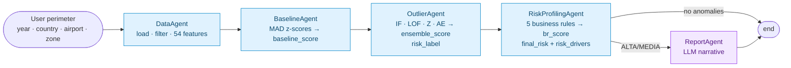
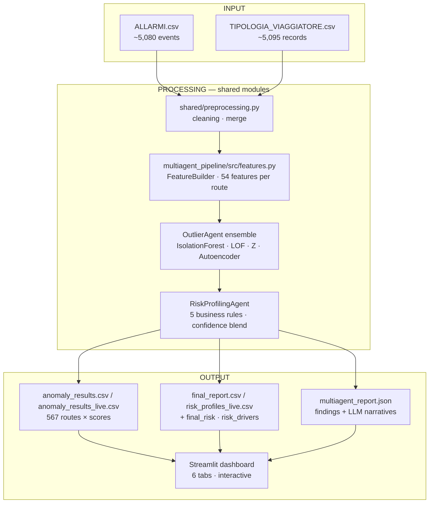

# Airport Risk Intelligence
**Reply × LUISS 2026 — Project 2 (Classical vs Multi-Agent)**

**Team**

- Daniele Giovanardi
- Filippo Nannucci
- Edoardo Riva

---

## Who we are and what this is

We're a team of three students competing in the **Reply × LUISS 2026 — Project 2** challenge. For Project 2 we were asked to build an anomaly-detection system on real airport security data and then argue which architectural approach works best.

Rather than just picking one approach and running with it, we decided to **build the same system twice** — once as a classical sequential pipeline (six step-by-step notebooks orchestrated by a single Python script) and once as a **LangGraph multi-agent system** with five specialised agents — so we could compare them properly. Same data, same features, same detection logic, two completely different architectures.

The question we're trying to answer: *when does adding agent orchestration actually buy you something over a well-written classical pipeline?*

> **Where to start reading.** The fastest path through the project is `main.ipynb` at the root of this repo: it stitches together the six classical-pipeline notebooks, the multi-agent code, and the comparative analysis into a single executable narrative. A reviewer who reads only `main.ipynb` sees the entire project end-to-end.

---

## The problem

Border control at Italian airports generates a lot of data: every passenger transit, every security alert, every document check. Most of this data sits unused until something goes wrong.

Our system looks at **routes** — pairs of `departure_airport → arrival_airport` (e.g. `CAI-FCO`, Cairo to Rome Fiumicino) — and asks: *is this route behaving anomalously compared to all the others?*

Concretely, we're looking for routes with unusual combinations of:
- High alarm rates (Interpol, SDI, NSIS)
- High investigation and rejection rates
- Low closure rates (alarms that don't get resolved)
- Unusual traveller profiles

We have ~567 unique routes and ~13 months of data. The output is a risk label per route: **ALTA** (top 3%), **MEDIA** (top 10%), **NORMALE**, plus a final business-rule classification CRITICO / ALTO / MEDIO / BASSO.

---

## Our reasoning

### Why a classical pipeline first

We started classically because it forced us to understand the data properly. Six notebooks, step by step: EDA, feature engineering, baseline construction, anomaly detection, post-processing, evaluation. By the end we had 54 features per route, a hybrid Tukey IQR + 2.5σ z-score baseline (more interpretable when explaining flags one feature at a time), and a 4-model weighted ensemble — IsolationForest, LOF, Z-score composite, and an Autoencoder.

The classical pipeline works well: reproducible, easy to audit, fast to iterate on. Its main limitation is rigidity — if you want to re-run on a different time window, or filter to a specific country, you re-run the whole thing.

### Why we then built a multi-agent version

The multi-agent version (LangGraph) replicates the **exact same detection logic** as a graph of five specialised agents. The interesting part is not the detection itself, but what we gain architecturally:

- **Dynamic perimeter filtering.** Pass `{anno, paese, aeroporto, zona}` at runtime and only the matching subset of data flows through the graph.
- **LLM explanations.** The `ReportAgent` uses Claude to write a plain-English narrative for each anomalous route, citing the specific z-score drivers and the business rules that fired.
- **Modularity.** Each agent can fail, retry, or be swapped independently. We don't re-run the whole thing if one stage changes.
- **Deterministic when needed.** `run_report=False` skips the LLM and produces the same numerical output as the classical pipeline in ~1.3 s.

The trade-off is complexity. A classical pipeline is easier to debug; a multi-agent system is more flexible at the cost of an extra orchestration layer.

The five agents (Reply spec topology):

| # | Agent | Responsibility |
|---|-------|---------------|
| 1 | `DataAgent` | Loads `ALLARMI` + `TIPOLOGIA_VIAGGIATORE`, applies the user-defined perimeter, and engineers 54 numerical features per route via `FeatureBuilder` (the same shared module the classical pipeline calls inline). |
| 2 | `BaselineAgent` | Robust MAD z-scores per BASELINE_FEATURE → composite `baseline_score` (mean of absolute z) consumed as the Z-component of the OutlierAgent ensemble. |
| 3 | `OutlierAgent` | 4-model weighted ensemble (real `sklearn` IF + LOF + Z + Autoencoder, where Z = BaselineAgent's `baseline_score`) → `ensemble_score` and `risk_label` (ALTA/MEDIA/NORMALE). |
| 4 | `RiskProfilingAgent` | Five business rules → `confidence` (60% ML + 40% rules) → `final_risk` (CRITICO/ALTO/MEDIO/BASSO) + per-route `risk_drivers`. |
| 5 | `ReportAgent` (LLM) | Optional Claude narrative for each ALTA/MEDIA route, citing top z-score drivers and the business rules that fired. Skipped automatically when no anomalies remain after profiling. |

Feature engineering lives inside `DataAgent` rather than in its own agent: it is a deterministic transformation of the same filtered data, and giving it a separate agent box would push the visible count to six without adding orchestration value.

### Architecture map



### Data flow (input → processing → output)



### What we found

After running both pipelines on the same 567 routes:

| Metric | Value |
|--------|-------|
| Same `anomaly_label` (ALTA/MEDIA/NORMALE) | **97.2 %** (551/567) |
| Distribution (ALTA / MEDIA / NORMALE) | **17 / 40 / 510** in BOTH pipelines |
| `ensemble_score` Pearson r | **0.9847** |
| `ensemble_score` Spearman ρ | **0.9864** |
| Per-model agreement: IsolationForest | **r = 1.0000** |
| Per-model agreement: LOF | **r = 1.0000** |
| Per-model agreement: Autoencoder | **r = 0.9663** (stochastic training) |
| Per-model agreement: Z-score | **r = 0.5808** (different baselines: Tukey IQR vs MAD — see *Design choices*) |
| Top-10 most-anomalous routes overlap | **9 / 10** |
| Top-50 most-anomalous routes overlap | **44 / 50** |

So the two architectures converge on the same answer. The multi-agent version reaches it with more operational flexibility (runtime filtering, route-by-route explanations, modular failure handling); the classical pipeline reaches it faster and with simpler audit trails.

The notebook `notebooks/07_comparison_classical_vs_multiagent.ipynb` contains the full quantitative comparison, including confusion matrix, score correlation, rank-delta distribution, and final recommendation.

---

## Results


---

## Project structure

```
classical-vs-multiagent/
│
├── README.md
├── main.ipynb                          # Single-notebook tour of the project
├── requirements.txt
├── .env.example                        # ANTHROPIC_API_KEY template
│
├── images/                             # Charts and visualisations
│   ├── top_routes_risk.png
│   ├── feature_distributions.png
│   └── feature_correlation.png
│
├── data/
│   ├── raw/                            # Source CSVs (gitignored — confidential)
│   │   ├── ALLARMI.csv
│   │   └── TIPOLOGIA_VIAGGIATORE.csv
│   └── processed/                      # Pipeline outputs (gitignored)
│
├── classical_pipeline/                 # ── Pipeline 1 ──────────────────────
│   ├── main.py                         # End-to-end orchestrator (single script)
│   └── notebooks/
│       ├── 01_EDA.ipynb
│       ├── 02_feature_engineering.ipynb
│       ├── 03_baseline_construction.ipynb
│       ├── 04_anomaly_detection.ipynb
│       ├── 05_post_processing.ipynb
│       └── 06_evaluation.ipynb
│
├── multiagent_pipeline/                # ── Pipeline 2 (LangGraph, 5 agents) ──
│   ├── main.py                         # Graph orchestrator
│   ├── state.py                        # Shared AgentState schema
│   ├── config.py                       # API key + model config
│   ├── agents/
│   │   ├── data_agent.py               # Loads, filters and feature-engineers
│   │   ├── baseline_agent.py           # Robust MAD z-scores
│   │   ├── outlier_agent.py            # 4-model weighted ensemble
│   │   ├── risk_profiling_agent.py     # 5 business rules + final_risk
│   │   └── report_agent.py             # LLM narrative explanations
│   ├── src/
│   │   └── features.py                 # FeatureBuilder (shared with classical)
│   ├── tools/
│   │   └── data_tools.py               # Perimeter filtering helpers
│   └── tests/
│       ├── e2e_validation.py           # 5-perimeter regression suite
│       └── test_risk_profiling_agent.py  # 13 unit tests on business rules
│
├── shared/
│   └── preprocessing.py                # Data cleaning used by both pipelines
│
├── streamlit_app/                      # ── Dashboard ────────────────────────
│   ├── app.py                          # Streamlit application (6 tabs)
│   └── agent_graph.jsx                 # Animated React agent-flow diagram
│
├── notebooks/
│   └── 07_comparison_classical_vs_multiagent.ipynb   # The head-to-head
│
└── docs/
    └── Reply_projects.pdf              # Original brief from Reply
```

---

## How to run it

### Setup

```bash
git clone https://github.com/DanieleGiovanardi2408/classical-vs-multiagent.git
cd classical-vs-multiagent
python -m venv venv && source venv/bin/activate
pip install -r requirements.txt
```

### Data source and reproducibility

The raw inputs (`ALLARMI.csv`, `TIPOLOGIA_VIAGGIATORE.csv`) are real **NoiPA** airport transit and security-alert data, provided by Reply for the LUISS 2026 challenge under a confidentiality agreement. They are **not redistributed** in this repository (`data/raw/` is in `.gitignore`).

> ⚠️ **Cannot be reproduced without the raw CSVs.** Without the original Reply-provided files in `data/raw/`, neither pipeline can run. The `data/processed/*.csv` artefacts shipped with the repo are committed only as evidence of past runs; they are gitignored under fresh clones. Contact the team or Reply for access to the raw inputs.

If you have the two CSVs, place them as:
```
data/raw/ALLARMI.csv
data/raw/TIPOLOGIA_VIAGGIATORE.csv
```

### Quickest start — run the whole story in one notebook

```bash
PYTHONPATH=. jupyter lab main.ipynb
```

`main.ipynb` is the executable end-to-end story of the project. It is structured as ten sections matching the workflow we actually followed:

1. **Exploratory Data Analysis** — content of `classical_pipeline/notebooks/01_EDA.ipynb`
2. **Data Preprocessing** — `shared/preprocessing.py` inlined: the cleaning + merge layer used by **both** pipelines (date parsing, ISO2→ISO3 country codes, gender normalisation, sparse column drop, route-level merge)
3. **Feature Engineering** — content of `02_feature_engineering.ipynb`
4. **Baseline Construction** — content of `03_baseline_construction.ipynb`
5. **Anomaly Detection** — content of `04_anomaly_detection.ipynb`
6. **Post-Processing & Risk Profiles** — content of `05_post_processing.ipynb`
7. **Evaluation** — content of `06_evaluation.ipynb`
8. **Multi-Agent Pipeline** — the five LangGraph agents inlined from `multiagent_pipeline/`
9. **Comparative Analysis** — content of `notebooks/07_comparison_classical_vs_multiagent.ipynb`
10. **Conclusions** — when to choose which architecture, limits, future work

The original step-by-step notebooks remain in the repo for those who want to drill into a single phase; the multi-agent code remains in `multiagent_pipeline/` because the Streamlit dashboard and the LangGraph orchestrator import it as a library; `shared/preprocessing.py` keeps the cleaning logic in one place so the classical script and the multi-agent `DataAgent` share the same source of truth.

### Classical pipeline

Run everything end-to-end:
```bash
PYTHONPATH=. python classical_pipeline/main.py --skip-eval     # ~3 s
PYTHONPATH=. python classical_pipeline/main.py                 # ~30 s incl. evaluation step
```

Or open the notebooks in order for the step-by-step walkthrough:
```bash
jupyter lab classical_pipeline/notebooks/
```

### Multi-agent pipeline

```python
from multiagent_pipeline.main import run_pipeline

# Without LLM (no API key needed)
state, summary = run_pipeline({"anno": 2024}, run_report=False, save_outputs=True)
# -> state["df_risk"]:  567 routes × 92 columns (incl. final_risk + risk_drivers)
# -> state["risk_meta"]["n_critico"], ["n_alto"], ["n_medio"], ["n_basso"]

# With LLM explanations (needs ANTHROPIC_API_KEY in .env)
state, summary = run_pipeline(
    {"anno": 2024},
    run_report=True,
    use_llm=True,
    save_outputs=True,
)
print(state["report"]["summary"])
```

### Comparison notebook

After running both pipelines:
```bash
PYTHONPATH=. jupyter lab notebooks/07_comparison_classical_vs_multiagent.ipynb
```

### Validation suite

Two layers of tests sit alongside the pipelines:

```bash
# 13 unit tests on the RiskProfilingAgent business rules — sub-second
PYTHONPATH=. python -m pytest multiagent_pipeline/tests/test_risk_profiling_agent.py -v

# 5-perimeter end-to-end regression (no LLM, ~3 s)
PYTHONPATH=. python multiagent_pipeline/tests/e2e_validation.py
# -> data/processed/multiagent_validation_report.json
```

### Dashboard (the nicest way to see everything)

```bash
streamlit run streamlit_app/app.py
```

Opens at `http://localhost:8501`. From here you can:
- Run the multi-agent pipeline with any filter combination
- See the agent graph animate as each of the 5 stages completes
- Explore the route map — click any route to see its risk details and the LLM explanation
- Compare classical vs multi-agent scores side by side

### LLM report (optional)

The `ReportAgent` calls Claude to generate plain-English explanations for each anomalous route. To enable it:

```bash
cp .env.example .env
# Add your key: ANTHROPIC_API_KEY=sk-ant-...
```

Then check **Enable LLM Report** in the dashboard sidebar before running. Without a key, use **Dry run** mode which runs the full pipeline but skips the API calls.

---

## Deviations from the Reply spec — and why

We deliberately deviated from the Reply spec in three places. Each deviation is documented here so a reviewer can interrogate the rationale rather than discover the gap on their own.

| Spec item (Reply, p.16–17) | Our choice | Rationale |
|---|---|---|
| *“Historical baseline using rolling averages and seasonal decomposition”* | We use cross-sectional MAD z-scores (multi-agent) and Tukey IQR + 2.5σ z-score (classical) | The dataset has only 13 months and ~567 routes — too few periods per route for a credible seasonal decomposition. Rolling averages over a 13-month window collapse to a near-mean. Robust per-population z-scores give a defensible, sample-size-friendly baseline that still answers the same question (“is this route deviating from the population norm?”). |
| *“Anomaly detection using IsolationForest, LOF, OR Z-score”* | We use a **weighted ensemble of all four** (IF 0.35 · LOF 0.30 · Z 0.15 · Autoencoder 0.20) | The autoencoder catches non-linear feature interactions the other three miss. It has graceful degradation: when fewer than 30 normal samples are available the autoencoder is excluded and the remaining three weights are renormalised, so small perimeters still work. |
| *Multi-agent topology shows 5 agents (Data → Baseline → Outlier → Risk Profiling → Report)* | We honour exactly this 5-agent topology, **with feature engineering inside `DataAgent`** | The Reply diagram doesn’t show a separate FeatureAgent. We tried that earlier and ended up with six visible agents — adding an orchestration node for a deterministic transformation didn’t buy resilience or branching. Inlining FeatureBuilder inside DataAgent keeps the spec count and avoids LangGraph hop overhead. |

## Design choices we want to flag explicitly

- **Different baseline methods on purpose.** Classical uses hybrid Tukey IQR + 2.5σ z-score (per-feature flags, more interpretable when justifying a single anomalous feature); multi-agent uses robust MAD z-scores (single composite `baseline_score` per route, more robust to outliers, easier to consume downstream). Both methods are deliberately idiomatic for their architecture; the comparative analysis (notebook 07) shows the final outputs converge regardless.

- **The BaselineAgent feeds the OutlierAgent ensemble directly.** The `baseline_score` produced by `BaselineAgent` (mean of absolute MAD z-scores) is consumed verbatim as the Z-component of the 4-model ensemble inside `OutlierAgent` (`score_z = minmax(baseline_score)`). This is visible in the code (no inline recomputation) and means the BaselineAgent is structurally part of the detection pipeline, not just a diagnostic side-output.
- **Autoencoder as 4th ensemble model.** The Reply spec lists `IsolationForest`, `LOF`, or `Z-score`. We added an MLPRegressor autoencoder (weight 0.20) because (a) it captures non-linear feature combinations the other three miss, and (b) it gracefully degrades — auto-excluded with weight redistribution when fewer than 30 normal samples are available, so small perimeters still work.
- **Same business rules in both pipelines.** The classical `step_post_processing` and the multi-agent `RiskProfilingAgent` share five identical rules with identical thresholds (high INTERPOL %, high rejection rate, low closure on volume, multi-source alarms, high average alarm rate). The `br_score` Pearson correlation between the two pipelines is exactly **1.000** — by construction.

---

## Limits of the current work

- **Single dataset, single client.** The whole evaluation runs on the NoiPA airport dataset (567 routes, 13 months). We have not stress-tested the pipelines against datasets with materially different schemas. The LLM schema-normalisation layer in `DataAgent` is implemented but never had to fire on real data.
- **No temporal model.** Both pipelines treat each route as a snapshot. Trends, seasonality and concept drift are out of scope. A route whose risk increases month-over-month would not be flagged as "rising" by either system.
- **Threshold sensitivity not characterised.** The five business-rule thresholds (high_interpol_pct ≥ 0.30, etc.) are inherited from the classical post-processing layer. We have unit tests that verify each rule fires at the threshold but no sensitivity analysis on how much the final ALTA/MEDIA counts move under perturbation.
- **LangGraph used in linear mode.** Conditional edges only implement stop-on-error. We do not exploit branching, loops, or supervisor patterns. The multi-agent value comes from orchestration robustness and modularity, not from emergent agent-to-agent reasoning.
- **LLM narratives are not validated.** We instruct Claude to cite specific drivers and we tag the prompt to refuse hallucinations, but we do not programmatically check that every generated narrative respects the requested format.
- **Comparative analysis uses 567 routes only.** The agreement metrics (97.2 %, r = 0.9847, etc.) are statistically representative but were not bootstrapped, so we do not report a confidence interval on the agreement number.

## Future work

- **Temporal extension.** Add a ChangePoint detector or a STL decomposition per route as a sixth agent (`TrendAgent`) that flags routes whose risk profile is drifting upward across the 13 months. This would honour the spec’s “rolling averages / seasonal decomposition” call-out without sacrificing the cross-sectional baseline that works today.
- **Real LangGraph branching.** A supervisor pattern where a sub-graph re-runs OutlierAgent with a stricter threshold on routes whose first-pass `final_risk == ALTO` to confirm or downgrade them. This is where the multi-agent architecture would start earning its complexity beyond orchestration.
- **A/B threshold dashboard.** Streamlit slider that lets an operator move any of the five business-rule thresholds and see the live impact on `final_risk` distribution, side-by-side with a “sensitivity matrix”.
- **Dataset benchmark suite.** A handful of synthetic datasets with controlled anomaly rates to characterise precision/recall and demonstrate the LLM schema-normalisation layer in action.
- **Multi-language LLM output.** The `ReportAgent` is currently English-only by hard prompt. A locale parameter that switches the narrative language for the operator is a small UX win that would also exercise prompt-engineering rigor.

## Tech stack

- **Data & ML**: pandas, numpy, scipy, scikit-learn
- **Agent orchestration**: LangGraph, LangChain
- **LLM**: Anthropic Claude (`claude-sonnet-4-5`)
- **Dashboard**: Streamlit, Plotly, Altair
- **Agent visualisation**: React 18 + Babel (embedded in Streamlit)
- **Explainability**: SHAP (surrogate GradientBoosting in the classical evaluation step)

---

*Reply × LUISS 2026 — Project 2*
