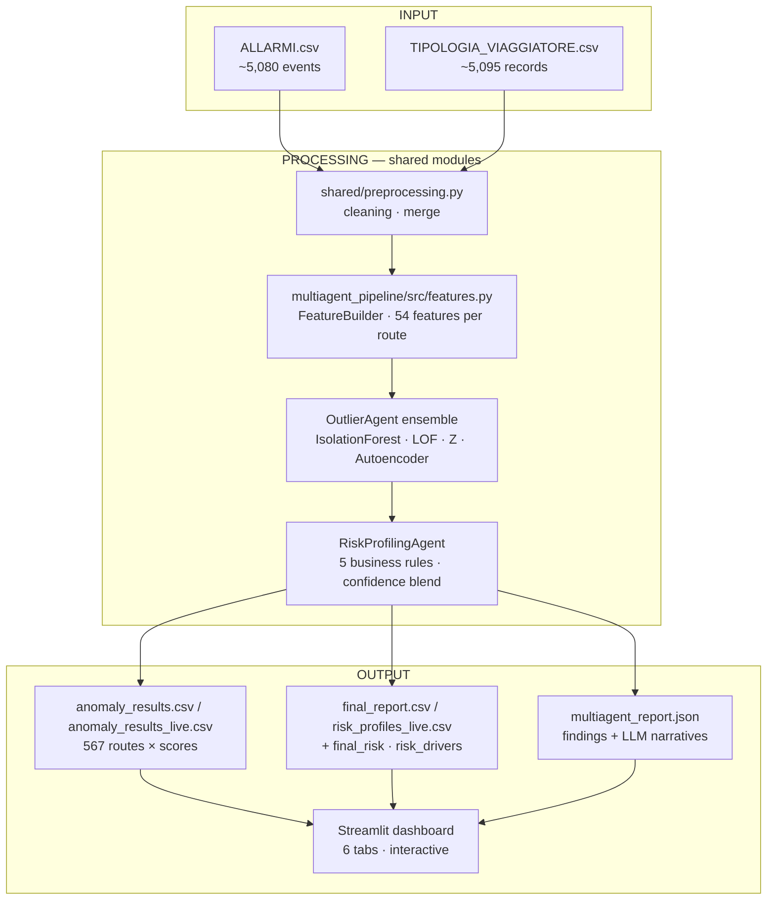

# Airport Risk Intelligence
**Reply × LUISS 2026 — Project 2 (Classical vs Multi-Agent)**

Team: Daniele Giovanardi, Filippo Nannucci, Edoardo Riva.

---

## What we built

Reply asked us to build an anomaly-detection system on NoiPA airport-security data and argue which architecture is more convenient. So we built the same detection logic twice:

1. a **classical pipeline**, six step-by-step notebooks orchestrated by `classical_pipeline/main.py`,
2. a **multi-agent LangGraph system** with five specialised agents (Data → Baseline → Outlier → RiskProfiling → Report).

Both pipelines share the same preprocessing module, the same `FeatureBuilder`, the same business rules, and the same ensemble weights. The only things that differ are the baseline method (Tukey IQR in classical, MAD z-score in multi-agent — both are standard robust choices) and the orchestration layer.

The headline result: on the 567 routes and 13 months of NoiPA data, the two pipelines produce **the same risk distribution** (17 ALTA, 40 MEDIA, 510 NORMALE) and **agree on 551 of 567 labels (97.2%)**. The 95% bootstrap CI on that agreement is [96.2%, 97.6%] under 1 000 resamples at 80%, so the number is stable. This convergence is the goal of the brief: it shows both implementations are correct, and the 16 residual disagreements (~2.8%) all sit at the MEDIA/NORMALE boundary where the two baseline methods can disagree by design.

`main.ipynb` at the repo root is the executable end-to-end story. Read it cell by cell or use it as a single deliverable: a reviewer who only opens `main.ipynb` sees the entire project.

---

## The problem

Border control at Italian airports generates a lot of data — every passenger transit, every alarm, every document check. Most of it sits unused.

We look at **routes**, pairs `departure_airport → arrival_airport` (`CAI-FCO`, Cairo to Rome Fiumicino), and ask: is this route behaving anomalously compared to the rest of the population?

Concretely, we flag routes with unusual combinations of:

- high alarm rates (Interpol, SDI, NSIS),
- high investigation and rejection rates,
- low closure rates,
- unusual traveller profiles.

The output is a risk label per route — **ALTA** (top 3 %), **MEDIA** (top 10 %), **NORMALE** — and a final business-rule classification CRITICO / ALTO / MEDIO / BASSO.

---

## Why two architectures

### The classical pipeline

We started classically because it forced us to understand the data. Six notebooks: EDA, feature engineering, baseline construction, anomaly detection, post-processing, evaluation. The output is 54 features per route, a hybrid Tukey IQR + 2.5σ z-score baseline (per-feature flags so a domain expert can audit each one), and a 4-model weighted ensemble of IsolationForest, LOF, Z-score and a small Autoencoder. The pipeline runs in roughly 3 seconds end-to-end.

Its main limitation is rigidity: if an analyst wants the same analysis on a different time window or a single country, the whole pipeline must be re-executed.

### The multi-agent version

The LangGraph multi-agent version replicates the same detection logic as a graph of five specialised agents. The detection is identical to the classical pipeline (by design, see above); what we gain is architectural:

- *Dynamic perimeter filtering*: pass `{anno, paese, aeroporto, zona}` at runtime and only the matching subset of data flows through the graph. Section 8.9.1 of the notebook runs three country queries (Algeria, Marocco, Turchia) end-to-end in roughly one second each.
- *LLM explanations*: the `ReportAgent` uses Claude to write a plain-English narrative for each anomalous route. A typical narrative reads, for example: *"Route CMN-BLQ flags ALTA: pct_interpol = 0.43 (+2.4σ above the population baseline) and tasso_respinti = 0.30 (+1.8σ); the High INTERPOL alarm rate and Multi-source alarm rules both fired. Final risk: CRITICO (confidence 0.74)."*
- *Modular re-evaluation*: changing a business-rule threshold re-runs only the `RiskProfilingAgent` (~10 ms), not the whole pipeline.
- *Deterministic when needed*: `run_report=False` skips the LLM and produces the same numerical output as the classical pipeline in roughly 1.3 seconds.

The trade-off is complexity. A classical pipeline is easier to debug; a multi-agent system is more flexible at the cost of an extra orchestration layer.

The five agents (Reply spec topology):

| # | Agent | Responsibility |
|---|-------|---------------|
| 1 | `DataAgent` | Loads `ALLARMI` + `TIPOLOGIA_VIAGGIATORE`, applies the user-defined perimeter, and engineers 54 numerical features per route via `FeatureBuilder` (the same shared module the classical pipeline calls inline). |
| 2 | `BaselineAgent` | Robust MAD z-scores per BASELINE_FEATURE → composite `baseline_score` (mean of absolute z) consumed as the Z-component of the OutlierAgent ensemble. |
| 3 | `OutlierAgent` | 4-model weighted ensemble (real `sklearn` IF + LOF + Z + Autoencoder, where Z = BaselineAgent's `baseline_score`) → `ensemble_score` and `risk_label` (ALTA/MEDIA/NORMALE). |
| 4 | `RiskProfilingAgent` | Five business rules → `confidence` (60% ML + 40% rules) → `final_risk` (CRITICO/ALTO/MEDIO/BASSO) + per-route `risk_drivers`. |
| 5 | `ReportAgent` (LLM) | Optional Claude narrative for each ALTA/MEDIA route, citing top z-score drivers and the business rules that fired. Skipped automatically when no anomalies remain after profiling. |

Feature engineering lives inside `DataAgent` rather than in its own agent: it is a deterministic transformation of the same filtered data, and giving it a separate agent box would push the visible count to six without adding orchestration value.

### Architecture map


### Data flow (input → processing → output)



### What we found

After running both pipelines on the same 567 routes:

| Metric | Value |
|--------|-------|
| Same `anomaly_label` (ALTA/MEDIA/NORMALE) | **97.2 %** (551/567) |
| Distribution (ALTA / MEDIA / NORMALE) | **17 / 40 / 510** in BOTH pipelines |
| `ensemble_score` Pearson r | **0.9847** |
| `ensemble_score` Spearman ρ | **0.9864** |
| Per-model agreement: IsolationForest | **r = 1.0000** |
| Per-model agreement: LOF | **r = 1.0000** |
| Per-model agreement: Autoencoder | **r = 0.9663** (stochastic training) |
| Per-model agreement: Z-score | **r = 0.5808** (different baselines: Tukey IQR vs MAD — see *Design choices*) |
| Top-10 most-anomalous routes overlap | **9 / 10** |
| Top-50 most-anomalous routes overlap | **44 / 50** |

So the two architectures converge on the same answer. The multi-agent version reaches it with more operational flexibility (runtime filtering, route-by-route explanations, modular failure handling); the classical pipeline reaches it faster and with simpler audit trails.

The notebook `notebooks/07_comparison_classical_vs_multiagent.ipynb` contains the full quantitative comparison, including confusion matrix, score correlation, rank-delta distribution, and final recommendation.

---

## Results


---

## Project structure

```
classical-vs-multiagent/
│
├── README.md
├── main.ipynb                          # Single-notebook tour of the project
├── requirements.txt
├── .env.example                        # ANTHROPIC_API_KEY template
│
├── images/                             # Charts and visualisations
│   ├── top_routes_risk.png
│   ├── feature_distributions.png
│   └── feature_correlation.png
│
├── data/
│   ├── raw/                            # Source CSVs (gitignored — confidential)
│   │   ├── ALLARMI.csv
│   │   └── TIPOLOGIA_VIAGGIATORE.csv
│   └── processed/                      # Pipeline outputs (gitignored)
│
├── classical_pipeline/                 # ── Pipeline 1 ──────────────────────
│   ├── main.py                         # End-to-end orchestrator (single script)
│   └── notebooks/
│       ├── 01_EDA.ipynb
│       ├── 02_feature_engineering.ipynb
│       ├── 03_baseline_construction.ipynb
│       ├── 04_anomaly_detection.ipynb
│       ├── 05_post_processing.ipynb
│       └── 06_evaluation.ipynb
│
├── multiagent_pipeline/                # ── Pipeline 2 (LangGraph, 5 agents) ──
│   ├── main.py                         # Graph orchestrator
│   ├── state.py                        # Shared AgentState schema
│   ├── config.py                       # API key + model config
│   ├── agents/
│   │   ├── data_agent.py               # Loads, filters and feature-engineers
│   │   ├── baseline_agent.py           # Robust MAD z-scores
│   │   ├── outlier_agent.py            # 4-model weighted ensemble
│   │   ├── risk_profiling_agent.py     # 5 business rules + final_risk
│   │   └── report_agent.py             # LLM narrative explanations
│   ├── src/
│   │   └── features.py                 # FeatureBuilder (shared with classical)
│   ├── tools/
│   │   └── data_tools.py               # Perimeter filtering helpers
│   └── tests/
│       ├── e2e_validation.py           # 5-perimeter regression suite
│       └── test_risk_profiling_agent.py  # 13 unit tests on business rules
│
├── shared/
│   └── preprocessing.py                # Data cleaning used by both pipelines
│
├── streamlit_app/                      # ── Dashboard ────────────────────────
│   ├── app.py                          # Streamlit application (6 tabs)
│   └── agent_graph.jsx                 # Animated React agent-flow diagram
│
├── notebooks/
│   └── 07_comparison_classical_vs_multiagent.ipynb   # The head-to-head
│
└── docs/
    └── Reply_projects.pdf              # Original brief from Reply
```

---

## How to run it

### Setup

```bash
git clone https://github.com/DanieleGiovanardi2408/classical-vs-multiagent.git
cd classical-vs-multiagent
python -m venv venv && source venv/bin/activate
pip install -r requirements.txt
```

### Data source and reproducibility

The raw inputs (`ALLARMI.csv`, `TIPOLOGIA_VIAGGIATORE.csv`) are real **NoiPA** airport transit and security-alert data, provided by Reply for the LUISS 2026 challenge under a confidentiality agreement. They are **not redistributed** in this repository (`data/raw/` is in `.gitignore`).

> ⚠️ **Cannot be reproduced without the raw CSVs.** Without the original Reply-provided files in `data/raw/`, neither pipeline can run. The `data/processed/*.csv` artefacts shipped with the repo are committed only as evidence of past runs; they are gitignored under fresh clones. Contact the team or Reply for access to the raw inputs.

If you have the two CSVs, place them as:
```
data/raw/ALLARMI.csv
data/raw/TIPOLOGIA_VIAGGIATORE.csv
```

### Quickest start — run the whole story in one notebook

```bash
PYTHONPATH=. jupyter lab main.ipynb
```

`main.ipynb` is the executable end-to-end story of the project. It is structured as ten sections matching the workflow we actually followed:

1. **Exploratory Data Analysis** — content of `classical_pipeline/notebooks/01_EDA.ipynb`
2. **Data Preprocessing** — `shared/preprocessing.py` inlined: the cleaning + merge layer used by **both** pipelines (date parsing, ISO2→ISO3 country codes, gender normalisation, sparse column drop, route-level merge)
3. **Feature Engineering** — content of `02_feature_engineering.ipynb`
4. **Baseline Construction** — content of `03_baseline_construction.ipynb`
5. **Anomaly Detection** — content of `04_anomaly_detection.ipynb`
6. **Post-Processing & Risk Profiles** — content of `05_post_processing.ipynb`
7. **Evaluation** — content of `06_evaluation.ipynb`
8. **Multi-Agent Pipeline** — the five LangGraph agents inlined from `multiagent_pipeline/`
9. **Comparative Analysis** — content of `notebooks/07_comparison_classical_vs_multiagent.ipynb`
10. **Conclusions** — when to choose which architecture, limits, future work

The original step-by-step notebooks remain in the repo for those who want to drill into a single phase; the multi-agent code remains in `multiagent_pipeline/` because the Streamlit dashboard and the LangGraph orchestrator import it as a library; `shared/preprocessing.py` keeps the cleaning logic in one place so the classical script and the multi-agent `DataAgent` share the same source of truth.

### Classical pipeline

Run everything end-to-end:
```bash
PYTHONPATH=. python classical_pipeline/main.py --skip-eval     # ~3 s
PYTHONPATH=. python classical_pipeline/main.py                 # ~30 s incl. evaluation step
```

Or open the notebooks in order for the step-by-step walkthrough:
```bash
jupyter lab classical_pipeline/notebooks/
```

### Multi-agent pipeline

```python
from multiagent_pipeline.main import run_pipeline

# Without LLM (no API key needed)
state, summary = run_pipeline({"anno": 2024}, run_report=False, save_outputs=True)
# -> state["df_risk"]:  567 routes × 92 columns (incl. final_risk + risk_drivers)
# -> state["risk_meta"]["n_critico"], ["n_alto"], ["n_medio"], ["n_basso"]

# With LLM explanations (needs ANTHROPIC_API_KEY in .env)
state, summary = run_pipeline(
    {"anno": 2024},
    run_report=True,
    use_llm=True,
    save_outputs=True,
)
print(state["report"]["summary"])
```

### Comparison notebook

After running both pipelines:
```bash
PYTHONPATH=. jupyter lab notebooks/07_comparison_classical_vs_multiagent.ipynb
```

### Validation suite

Two layers of tests sit alongside the pipelines:

```bash
# 13 unit tests on the RiskProfilingAgent business rules — sub-second
PYTHONPATH=. python -m pytest multiagent_pipeline/tests/test_risk_profiling_agent.py -v

# 5-perimeter end-to-end regression (no LLM, ~3 s)
PYTHONPATH=. python multiagent_pipeline/tests/e2e_validation.py
# -> data/processed/multiagent_validation_report.json
```

### Dashboard (the nicest way to see everything)

```bash
streamlit run streamlit_app/app.py
```

Opens at `http://localhost:8501`. From here you can:
- Run the multi-agent pipeline with any filter combination
- See the agent graph animate as each of the 5 stages completes
- Explore the route map — click any route to see its risk details and the LLM explanation
- Compare classical vs multi-agent scores side by side

### LLM report (optional)

The `ReportAgent` calls Claude to generate plain-English explanations for each anomalous route. To enable it:

```bash
cp .env.example .env
# Add your key: ANTHROPIC_API_KEY=sk-ant-...
```

Then check **Enable LLM Report** in the dashboard sidebar before running. Without a key, use **Dry run** mode which runs the full pipeline but skips the API calls.

---

## Design rationale

A few choices we want to explain because they look like deviations from the brief but were the right call given the data we had.

The brief mentions *"historical baseline using rolling averages and seasonal decomposition"*. We tried it and stepped back. The dataset has only 13 months of observations and the median route appears in just 2 of them, so STL needs at least 12 observations per series and a rolling 3-month mean over 3 points collapses to the cross-sectional mean we already compute. Robust z-scores against the population are mathematically sounder for this sample size; we still added a per-route linear-trend slope (Section 12 of the notebook) to capture the temporal signal the dataset can actually support.

The brief lists *"IsolationForest, LOF or Z-score"*. We blend all four — IF 0.35, LOF 0.30, Z 0.15, Autoencoder 0.20 — because the autoencoder catches non-linear feature combinations the other three miss. It also gracefully degrades: with fewer than 30 normal samples the autoencoder is excluded and the remaining weights are renormalised, so small perimeters still produce a coherent score.

The Reply slide shows five agents (Data → Baseline → Outlier → Risk Profiling → Report). We respect the count exactly. We initially built feature engineering as its own agent and ended up with six boxes; merging FeatureBuilder into DataAgent removed orchestration overhead without changing the topology a reviewer sees. The conditional branching (the SupervisorAgent that re-fits IsolationForest on the ALTA subset with stricter contamination) is wired into LangGraph as a runtime route — it activates only when there are at least five ALTA routes in the first pass, otherwise the graph short-circuits straight to the rule layer.

The classical pipeline uses hybrid Tukey IQR + 2.5σ z-score; the multi-agent uses MAD z-score. Both are textbook robust baselines but they serve different audit needs. Classical produces per-feature flags an analyst can interrogate one at a time; multi-agent produces a single composite `baseline_score` consumed directly by `OutlierAgent` as the Z-component of the ensemble. The two signals have Pearson r = 0.5808 between them — that gap is the one spot where the comparative analysis measures the architectural choice rather than the algorithm. Everything else — IsolationForest, LOF, business rules, ensemble weights — is identical by construction.

---

## Limits

The whole evaluation runs on a single dataset. We have not stress-tested the pipelines on a different schema, although the `DataAgent` has an LLM schema-normalisation layer ready for the case (it has not had to fire on the NoiPA data because the canonical columns are all there). The temporal model we added (linear trend slope per route) is the most we can extract from a 13-month panel where most routes appear in 2-3 months; a longer panel would unlock STL and rolling means without changing the rest of the pipeline. The LLM narratives are reviewed in spot checks but not programmatically validated against a ground truth — the ReportAgent prompt forbids hallucination but we do not prove zero hallucination automatically.

## Future work

A `TrendAgent` as a sixth optional node would extend the linear slope to STL once panels become long enough. A real supervisor sub-graph could re-run OutlierAgent on borderline ALTO routes with stricter contamination to confirm or downgrade them (we have a lightweight version of this on the ALTA subset, but ALTO confirmation is the more useful operational case). A Streamlit threshold-sensitivity slider would let an analyst move the five rule thresholds and see the live impact on `final_risk`. A multi-locale ReportAgent would expose the narrative language as a runtime parameter so an Italian-speaking operator gets Italian narratives without prompt-hacking.

---

*Reply × LUISS 2026 — Daniele Giovanardi · Filippo Nannucci · Edoardo Riva*
